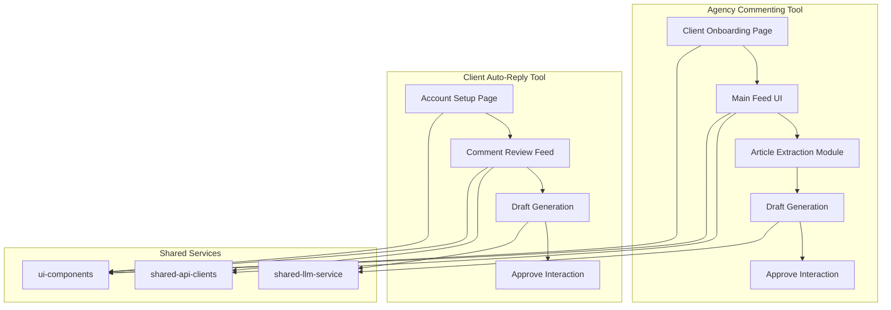

# Instabot Monorepo

## 1. Project Overview

This monorepo contains two related web applications—**Agency Commenting Tool** and **Client Auto‑Reply Tool**—plus shared services. The project is designed to streamline social media engagement by using LLMs to generate context-aware comments and replies.

- **Agency Commenting Tool**: A tool for marketing agencies to manage and approve comments on their clients' social media posts.
- **Client Auto-Reply Tool**: A tool for businesses to automatically reply to comments on their own social media pages.

## 2. Prerequisites & Dependencies

- Node.js (v18+)
- Yarn
- Docker (for deployment)

## 3. Setup & Installation

1.  **Clone the repository:**
    ```bash
    git clone <repository-url>
    cd instabot-monorepo
    ```
2.  **Install dependencies:**
    ```bash
    yarn install
    ```
3.  **Configure environment variables:**
    Create a `.env` file in the root of the project and add the following:
    ```
    OPENAI_API_KEY=your_openai_api_key
    ```

## 4. Environment Variables & Secrets

| Variable | Description |
| --- | --- |
| `OPENAI_API_KEY` | Your OpenAI API key for accessing GPT-4. |
| `WORDPRESS_API_TOKEN` | Your WordPress API token for the Agency Commenting Tool. |
| `FACEBOOK_APP_ID` | Your Facebook App ID for the Client Auto-Reply Tool. |
| `FACEBOOK_APP_SECRET` | Your Facebook App Secret for the Client Auto-Reply Tool. |

## 5. Agency Tool Usage & Walkthrough

1.  **Onboard a client:**
    - Navigate to the "Onboard Client" page.
    - Enter the client's social media account URLs and API credentials.
    - The tool will test the connection and show a success message.
2.  **Manage the feed:**
    - The main feed shows new posts from your clients.
    - For each post, the tool will generate three comment variations.
    - Swipe to approve a comment or click the "Approve" button.
    - The approved comment will be posted to the client's social media account.

## 6. Client Tool Usage & Walkthrough

1.  **Connect your accounts:**
    - Navigate to the "Account Setup" page.
    - Connect your Facebook, Instagram, and YouTube accounts using OAuth2.
2.  **Review comments:**
    - The comment review feed shows incoming comments from your connected accounts.
    - For each comment, the tool will generate three reply drafts.
    - Swipe to approve a reply or click the "Post Reply" button.
    - The approved reply will be posted to your social media account.

## 7. Architecture Diagrams & Component Descriptions

### Mermaid Diagram



### Key Code Snippets

#### OAuth2 Setup (Client Auto-Reply Tool)

```javascript
// Example using Passport.js for Facebook authentication
const passport = require('passport');
const FacebookStrategy = require('passport-facebook').Strategy;

passport.use(new FacebookStrategy({
    clientID: process.env.FACEBOOK_APP_ID,
    clientSecret: process.env.FACEBOOK_APP_SECRET,
    callbackURL: "/auth/facebook/callback"
  },
  function(accessToken, refreshToken, profile, cb) {
    // Store tokens securely
    return cb(null, profile);
  }
));
```

#### Puppeteer Scraper Module

```javascript
const puppeteer = require('puppeteer');

async function scrapeArticle(url) {
  const browser = await puppeteer.launch();
  const page = await browser.newPage();
  await page.goto(url, { waitUntil: 'networkidle0' });
  const articleContent = await page.evaluate(() => {
    // Use Readability.js or a similar library to extract the article content
    const article = new Readability(document).parse();
    return article.textContent;
  });
  await browser.close();
  return articleContent;
}
```

#### Readability Integration

```javascript
const { JSDOM } = require('jsdom');
const { Readability } = require('@mozilla/readability');

function extractArticle(html) {
  const doc = new JSDOM(html);
  const reader = new Readability(doc.window.document);
  const article = reader.parse();
  return article.textContent;
}
```

#### LLM Service

```javascript
const OpenAI = require('openai');

const openai = new OpenAI({
  apiKey: process.env.OPENAI_API_KEY,
});

async function generateComment(postContent, brandTone) {
  const prompt = `
    System: You are a social media assistant for the ${brandTone} brand.
    Generate three distinct, engaging comments for the following blog post.
    Each comment should be under 280 characters.

    Post Content: ${postContent}

    Comment 1:
    Comment 2:
    Comment 3:
  `;

  const response = await openai.chat.completions.create({
    model: 'gpt-4',
    messages: [{ role: 'system', content: prompt }],
    n: 3,
    max_tokens: 150,
  });

  return response.choices.map(choice => choice.message.content.trim());
}
```

#### React Feed Components

```javascript
import React, { useState, useEffect } from 'react';
import InfiniteScroll from 'react-infinite-scroll-component';
import { motion } from 'framer-motion';

const Feed = () => {
  const [items, setItems] = useState([]);
  const [hasMore, setHasMore] = useState(true);

  const fetchMoreData = () => {
    // Fetch more data from your API
  };

  useEffect(() => {
    fetchMoreData();
  }, []);

  return (
    <InfiniteScroll
      dataLength={items.length}
      next={fetchMoreData}
      hasMore={hasMore}
      loader={<h4>Loading...</h4>}
    >
      {items.map((item, index) => (
        <motion.div
          key={index}
          drag="x"
          dragConstraints={{ left: 0, right: 0 }}
          onDragEnd={(event, info) => {
            if (info.offset.x > 100) {
              // Approve
            } else if (info.offset.x < -100) {
              // Reject
            }
          }}
        >
          {/* Your item content here */}
        </motion.div>
      ))}
    </InfiniteScroll>
  );
};
```

## 8. Detailed Article Extraction and LLM Prompting Guide

The article extraction process uses a combination of Puppeteer and Readability.js to extract the content of a given URL. The extracted content is then passed to the LLM service to generate comments.

The LLM prompt is carefully crafted to ensure that the generated comments are in the correct tone and style for the brand. The prompt includes the brand name, the post content, and instructions for generating three distinct comments.

## 9. Error Handling & Troubleshooting

- **Rate limiting:** The application uses a backoff strategy to handle rate limiting from social media APIs.
- **Error logging:** All errors are logged to the Elastic Stack for easy debugging.
- **Alerting:** Alerts are configured to notify the team of any critical errors.

## 10. Testing & CI/CD Pipeline

- **Unit tests:** Jest is used for unit testing the application.
- **Integration tests:** Cypress is used for integration testing the application.
- **CI/CD:** GitHub Actions is used to automate the testing and deployment of the application.

## 11. Deployment (Docker, Kubernetes, Serverless)

The application is deployed using Docker and Kubernetes. The application is also designed to be deployed to a serverless environment such as AWS Lambda.

## 12. Contribution Guidelines & Code Style

- **Code style:** The project follows the Airbnb JavaScript Style Guide.
- **Commit messages:** The project follows the Conventional Commits specification.
- **Pull requests:** All pull requests must be reviewed and approved by at least one other developer.

## 13. License and Acknowledgements

This project is licensed under the MIT License.

We would like to thank the following projects for their contributions:

- [React](https://reactjs.org/)
- [Node.js](https://nodejs.org/)
- [Puppeteer](https://pptr.dev/)
- [Readability.js](https://github.com/mozilla/readability)
- [OpenAI](https://openai.com/)
